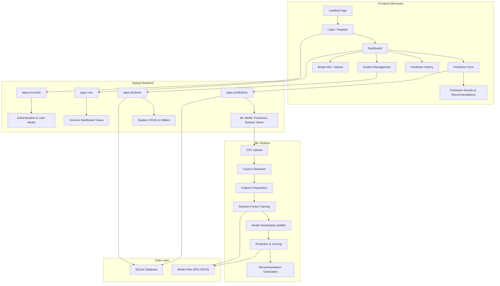
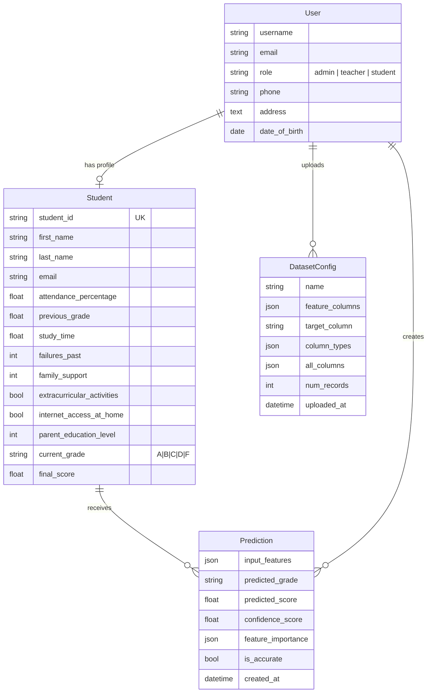

# AI-Based Student Performance Prediction System

## Project Report

---

**Project Title:** AI-Based Student Performance Prediction System

**Technology Stack:** Python, Django, Scikit-learn, Pandas, NumPy, Bootstrap 5

**Date:** May 2026

---

## Table of Contents

1. [Introduction](#1-introduction)
2. [Statement of the Problem](#2-statement-of-the-problem)
3. [Objectives of the Project](#3-objectives-of-the-project)
4. [Scope and Limitations](#4-scope-and-limitations)
5. [Significance of the Project](#5-significance-of-the-project)
6. [System Architecture and Design](#6-system-architecture-and-design)
7. [Implementation Details](#7-implementation-details)
8. [Conclusion](#8-conclusion)

---

## 1. Introduction

Education is one of the most critical sectors in any society, and the ability to predict and improve student academic performance has long been a priority for educational institutions worldwide. Traditional methods of evaluating student performance rely heavily on retrospective analysis — examining grades and test scores after they have already been obtained. This approach, while informative, fails to provide the early intervention opportunities that could prevent academic failure before it occurs.

The **AI-Based Student Performance Prediction System** is an intelligent web application that leverages **Machine Learning (ML)** and **Artificial Intelligence (AI)** techniques to predict student academic outcomes based on a comprehensive set of academic, behavioral, and environmental features. The system empowers educators, administrators, and students themselves with data-driven insights and actionable recommendations to improve learning outcomes.

### Techniques and Technologies Applied

The project integrates the following AI/ML techniques and web technologies:

| Category | Technology / Technique | Purpose |
|---|---|---|
| **Machine Learning Algorithm** | Random Forest Classifier (Scikit-learn) | Multi-class grade prediction (A, B, C, D, F) |
| **Feature Engineering** | Automatic column type detection | Dynamic adaptation to any uploaded CSV dataset |
| **Data Preprocessing** | StandardScaler, LabelEncoder | Feature scaling and categorical variable encoding |
| **Model Evaluation** | Train/Test Split, Accuracy Score, Classification Report | Measuring model reliability and per-class performance |
| **Web Framework** | Django 6.0 (Python) | Full-stack web application with MVC architecture |
| **Frontend** | Bootstrap 5, Chart.js | Responsive UI, interactive data visualizations |
| **Database** | SQLite | Persistent storage for users, students, predictions |
| **Data Processing** | Pandas, NumPy | Dataset ingestion, manipulation, and statistical analysis |

The system is designed with a **dynamic data ingestion pipeline**, meaning it does not require a fixed dataset schema. Administrators can upload any CSV file, select the target column to predict, and the system will automatically detect feature types (numeric, boolean, categorical), train the model, and generate a dynamic prediction form — all without writing a single line of code.

---

## 2. Statement of the Problem

Educational institutions face a persistent and growing challenge: **identifying students who are at risk of academic underperformance before it is too late to intervene.** The key problems this project addresses are:

1. **Reactive Rather Than Proactive Assessment:** Traditional academic evaluation is inherently backward-looking. Students receive grades after examinations, at which point the opportunity for meaningful intervention during the learning period has already passed. Teachers and administrators lack reliable tools to forecast academic outcomes in advance.

2. **Lack of Data-Driven Decision Making:** Many educational institutions collect vast amounts of student data — attendance records, past grades, family background information, study habits — but lack the analytical tools to extract actionable insights from this data. Decisions about student support, resource allocation, and curriculum adjustments are often made based on intuition rather than evidence.

3. **One-Size-Fits-All Interventions:** Without personalized analysis, intervention strategies tend to be generic. A student struggling due to low attendance requires fundamentally different support than one with adequate attendance but insufficient study time. Current systems do not differentiate between these root causes.

4. **Manual and Time-Consuming Processes:** The process of manually reviewing individual student records, identifying patterns, and generating recommendations is extremely labor-intensive. This limits the ability of educators to provide timely and personalized support, especially in institutions with large student populations.

5. **Inflexibility of Existing Systems:** Many existing prediction tools are hardcoded to work with specific datasets or fixed feature sets. When institutions change their data collection methods or want to analyze new variables, these tools become obsolete, requiring costly redevelopment.

**In summary,** there is a critical need for an intelligent, flexible, and user-friendly system that can automatically analyze diverse student data, predict academic outcomes with measurable confidence, and generate personalized recommendations — all accessible through a modern web interface with appropriate role-based access controls.

---

## 3. Objectives of the Project

The primary objectives of this project are as follows:

### 3.1 Primary Objectives

1. **To develop an AI-powered prediction engine** that accurately classifies student academic performance into grade categories (A, B, C, D, F) using a Random Forest Classifier trained on institution-specific data.

2. **To build a dynamic data ingestion pipeline** that allows administrators to upload any CSV dataset, automatically detect column types, select the target variable, and train the machine learning model without requiring technical expertise or code modifications.

3. **To implement a personalized recommendation system** that compares individual student feature values against dataset averages and generates data-driven, actionable improvement suggestions ranked by feature importance and deviation severity.

4. **To create a role-based web application** with differentiated dashboards and access controls for three user types:
   - **Administrators** — Full system control: dataset management, model training, student management, and prediction oversight.
   - **Teachers** — Prediction access for any student, prediction history review, and student performance monitoring.
   - **Students** — Self-service predictions, personal history viewing, and academic overview.

5. **To provide comprehensive data visualization and analytics** through interactive dashboards featuring grade distribution charts, prediction history tracking, model performance metrics, and at-risk student identification.

### 3.2 Secondary Objectives

- To ensure the system is extensible and adaptable to different educational contexts and dataset structures.
- To implement secure authentication with password management capabilities.
- To automatically import student records from uploaded datasets into the student management module.
- To display feature importance analysis so educators understand which factors most influence predictions.

---

## 4. Scope and Limitations

### 4.1 Scope of the Project

The project encompasses the following functional areas:

#### In Scope

| Module | Features |
|---|---|
| **User Management** | Registration, login/logout, role assignment (Admin, Teacher, Student), password change, user profiles |
| **Dataset Management** | CSV upload, automatic column type detection, target column selection, column exclusion, data preview |
| **Model Training** | Automated Random Forest training, feature scaling, categorical encoding, train/test evaluation, accuracy reporting |
| **Prediction Engine** | Dynamic form generation, real-time prediction, confidence scoring, probability distribution |
| **Recommendation System** | Feature comparison against dataset averages, severity-weighted recommendations, importance-ranked suggestions |
| **Student Management** | Automatic student record import from CSV, student list with pagination, student editing, student deletion |
| **Dashboard Analytics** | Grade distribution charts (Chart.js), total students/predictions counters, at-risk student identification, recent predictions table |
| **Prediction History** | Full prediction log, role-filtered history, recommendation summaries, prediction deletion |

#### Out of Scope

- Real-time integration with external Learning Management Systems (LMS) such as Moodle or Blackboard.
- Support for non-CSV data formats (e.g., Excel, JSON, database imports).
- Multi-language (internationalization) support.
- Mobile-native application development (the system is a responsive web application).
- Deployment to cloud production environments (the system is configured for local development).

### 4.2 Limitations

The following constraints may affect the execution and success of the project:

| Constraint | Description |
|---|---|
| **Data Quality Dependency** | The accuracy of predictions is directly dependent on the quality, completeness, and representativeness of the uploaded training data. Poor or biased data will result in unreliable predictions. |
| **Single Algorithm** | The current implementation uses only the Random Forest Classifier. While robust, it may not be optimal for all dataset types. No algorithm comparison or hyperparameter tuning interface is provided. |
| **Local Deployment** | The system is configured for local development with SQLite and Django's development server. Production deployment would require additional configuration (PostgreSQL, Gunicorn, Nginx, etc.). |
| **Static Model** | Once trained, the model does not continuously learn from new predictions. Retraining requires re-uploading the dataset. |
| **Dataset Size** | Very large datasets (millions of rows) may cause performance issues due to in-memory processing with Pandas and Scikit-learn. |
| **Technology Stack** | The system requires Python 3.x with specific library versions (Django 6.0, Scikit-learn 1.8.0, Pandas 3.0.2), which may present compatibility challenges in certain environments. |
| **Time Constraints** | Developed within an academic project timeframe, limiting the depth of model optimization and UX refinement. |

---

## 5. Significance of the Project

The AI-Based Student Performance Prediction System holds significant importance across multiple dimensions:

### 5.1 Educational Impact

- **Early Intervention:** By predicting student grades before final examinations, the system enables educators to identify at-risk students early and implement targeted support strategies. Research consistently shows that early intervention is the single most effective approach to preventing academic failure.

- **Personalized Learning Support:** The recommendation engine generates feature-specific suggestions (e.g., "Improve Attendance by attending classes regularly" or "Increase Study Hours and keep a consistent study schedule"), moving beyond generic advice to actionable, data-driven guidance tailored to each student's unique profile.

- **Data-Informed Decision Making:** Administrators and teachers gain access to aggregate analytics — grade distributions, prediction confidence levels, at-risk student counts — enabling evidence-based decisions about curriculum design, resource allocation, and student support programs.

### 5.2 Technical Significance

- **Dynamic Architecture:** Unlike hardcoded prediction systems, this project's dynamic data ingestion pipeline represents a significant technical advancement. The system automatically adapts to any CSV dataset structure, detecting column types, generating appropriate form inputs, and training the model — making it reusable across different institutions and data formats.

- **End-to-End ML Pipeline:** The project demonstrates a complete machine learning workflow integrated into a production-ready web application: data ingestion → preprocessing → training → evaluation → prediction → recommendation generation.

- **Role-Based Security Model:** The implementation of differentiated access controls ensures data privacy and operational security, with students limited to their own data while administrators maintain full system oversight.

### 5.3 Practical Value

- **Reduced Manual Workload:** Automating the prediction and recommendation process saves educators significant time that would otherwise be spent manually analyzing student records and formulating intervention strategies.

- **Scalability Potential:** The modular Django architecture and dynamic feature system provide a solid foundation for future enhancements, including additional algorithms, real-time data integration, and deployment to cloud infrastructure.

- **Institutional Adaptability:** The system's ability to work with any CSV dataset makes it immediately applicable to diverse educational contexts — from primary schools tracking basic metrics to universities analyzing complex multi-dimensional student data.

---

## 6. System Architecture and Design

### 6.1 High-Level Architecture

The system follows the **Model-View-Template (MVT)** architectural pattern as prescribed by the Django framework, organized into four modular Django applications:

### 6.2 Application Modules

| Django App | Responsibility | Key Files |
|---|---|---|
| `apps.core` | Landing page, dashboard routing, context processors | `views.py`, `context_processors.py` |
| `apps.accounts` | User authentication, registration, role management, password change | `models.py` (Custom User), `views.py`, `forms.py`, `urls.py` |
| `apps.predictions` | ML model training, prediction engine, dataset upload, recommendation system | `ml_model.py`, `models.py`, `views.py`, `forms.py`, `urls.py` |
| `apps.students` | Student record management, auto-profile creation, CRUD operations | `models.py`, `views.py`, `forms.py`, `utils.py` |

### 6.3 Data Models

---

## 7. Implementation Details

### 7.1 Machine Learning Pipeline

The core ML engine is implemented in `apps/predictions/ml_model.py` as the `StudentPerformanceModel` class. The pipeline follows these stages:

#### Stage 1: Data Ingestion and Column Detection

When an administrator uploads a CSV file, the system automatically analyzes each column:

- **Numeric columns** (`int64`, `float64`) → Used directly as features.
- **Boolean columns** (binary 0/1 values) → Converted to integer features.
- **Categorical columns** (text with ≤ 20 unique values) → Encoded using `LabelEncoder`.
- **Identifier columns** (`student_id`, `name`, etc.) → Automatically excluded from features.

#### Stage 2: Model Training

The training pipeline operates as follows:

1. Features are prepared using the detected column types.
2. If the target column is continuous (numeric), it is automatically binned into five grade categories (A, B, C, D, F) using quantile-based discretization (`pd.qcut`).
3. Data is split into training (80%) and testing (20%) sets with stratified sampling when possible.
4. Features are scaled using `StandardScaler`.
5. A `RandomForestClassifier` is trained with 100 estimators, max depth of 10, and balanced class weights.
6. Feature statistics (min, max, mean, median) are computed and saved for the recommendation engine.
7. The trained model, scaler, label encoders, and configuration are serialized to disk using `joblib` and JSON.

#### Stage 3: Prediction and Scoring

For each prediction request:

1. Input features are collected via the dynamically generated form.
2. Features are prepared using the same encoding scheme as training.
3. The scaler transforms the features to match the training distribution.
4. The Random Forest model produces:
   - **Predicted Grade** — The most likely grade class (A through F).
   - **Predicted Score** — A weighted numeric estimate based on class probabilities.
   - **Confidence Score** — The maximum class probability as a percentage.
   - **Probability Distribution** — Per-class prediction probabilities.

#### Stage 4: Recommendation Generation

The recommendation engine compares each input feature against the dataset average:

- Features **below 90% of the mean** are flagged for improvement.
- Boolean features that are **0 when the average is ≥ 0.5** generate targeted recommendations.
- Recommendations are ranked by a **priority score** = `feature_importance × severity_of_deviation`.
- Each recommendation includes a context-aware message generated from keyword analysis of the feature name (e.g., features containing "attendance" produce attendance-specific advice).

### 7.2 Key Features Summary

| Feature | Description |
|---|---|
| **Dynamic Form Generation** | Prediction form fields are automatically created based on the trained model's features, with appropriate input types (number, dropdown, boolean) and validation ranges derived from dataset statistics. |
| **Role-Based Dashboards** | Administrators see aggregate statistics, charts, and management tools. Students see their own academic overview and prediction results. |
| **Automatic Student Import** | When a dataset is uploaded and trained, student records are automatically created or updated in the database from the CSV data. |
| **Feature Importance Visualization** | The model info page displays feature importance percentages, showing which factors most influence grade predictions. |
| **Grade Distribution Charts** | Interactive bar charts (Chart.js) visualize the distribution of grades across all registered students. |
| **Prediction History Tracking** | All predictions are stored with full input features, results, and timestamps, allowing longitudinal analysis. |
| **At-Risk Student Identification** | The dashboard highlights students with predicted grades of D or F, enabling proactive intervention. |

### 7.3 Technology Stack Details

| Layer | Technology | Version |
|---|---|---|
| Programming Language | Python | 3.x |
| Web Framework | Django | 6.0.4 |
| Machine Learning | Scikit-learn | 1.8.0 |
| Data Processing | Pandas | 3.0.2 |
| Numerical Computing | NumPy | 2.4.4 |
| Model Serialization | Joblib | 1.4.0 |
| CSS Framework | Bootstrap | 5.x |
| Form Rendering | django-crispy-forms + crispy-bootstrap5 | 2.1 / 0.7 |
| Charts | Chart.js | Latest (CDN) |
| Database | SQLite | 3.x |
| Environment Config | python-dotenv | 1.0.0 |
| Image Processing | Pillow | 10.3.0 |

---

## 8. Conclusion

The **AI-Based Student Performance Prediction System** successfully demonstrates how machine learning can be integrated into a practical, user-friendly web application to address real educational challenges. The project achieves its primary objectives:

1. **A functional prediction engine** powered by a Random Forest Classifier that accepts dynamically structured input data and produces grade predictions with confidence scores and probability distributions.

2. **A fully dynamic data pipeline** that eliminates the need for hardcoded dataset schemas. Administrators can upload any CSV file, and the system automatically adapts its feature detection, model training, form generation, and recommendation logic to the new data.

3. **A personalized recommendation system** that goes beyond simple grade prediction to provide actionable, feature-specific improvement suggestions, ranked by statistical importance and individual deviation from the norm.

4. **A role-based web application** with differentiated experiences for administrators, teachers, and students, ensuring appropriate access controls and relevant information presentation for each user type.

5. **Comprehensive analytics and visualization** through interactive dashboards that provide at-a-glance insights into overall student performance, model effectiveness, and prediction trends.

### Key Achievements

- The system successfully trains a Random Forest model on uploaded datasets with automatic feature type detection and handles both numeric and categorical target variables.
- Dynamic form generation ensures the prediction interface always matches the current model's feature set, with intelligent validation constraints.
- The recommendation engine provides contextually relevant advice by combining feature importance analysis with individual performance comparison.
- The modular Django architecture ensures maintainability and extensibility for future enhancements.

### Future Work

While the current implementation fulfills the project requirements, several avenues for future enhancement exist:

- **Algorithm Comparison:** Implementing multiple ML algorithms (e.g., Gradient Boosting, Neural Networks, SVM) with automatic selection of the best-performing model.
- **Hyperparameter Tuning:** Adding GridSearchCV or RandomizedSearchCV for automated model optimization.
- **Real-Time Data Integration:** Connecting with institutional LMS platforms for continuous data feeds.
- **Advanced Visualizations:** Adding trend analysis, performance trajectory charts, and cohort comparisons.
- **Cloud Deployment:** Migrating to a production environment with PostgreSQL, containerization (Docker), and cloud hosting.
- **Continuous Learning:** Implementing incremental learning so the model improves as new prediction outcomes are verified.

In conclusion, this project demonstrates the practical application of artificial intelligence in education, providing a scalable, adaptable, and user-friendly tool that empowers educators with data-driven insights and students with personalized guidance for academic improvement.

---

> **Note:** This system is designed for demonstration and academic purposes. For production deployment in an educational institution, additional considerations for data privacy regulations (such as FERPA), security hardening, database scaling, and model validation would be required.

---

*End of Project Report*
